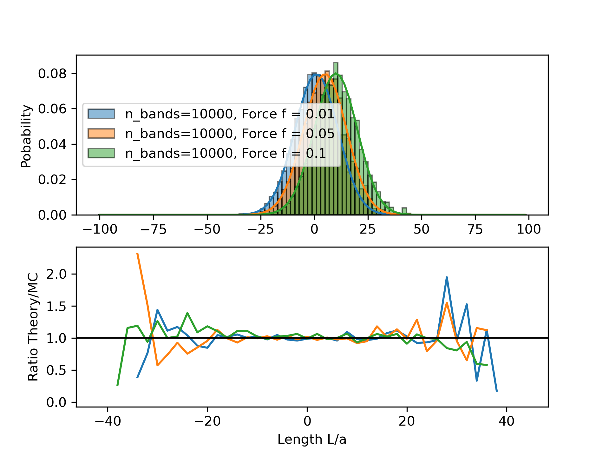
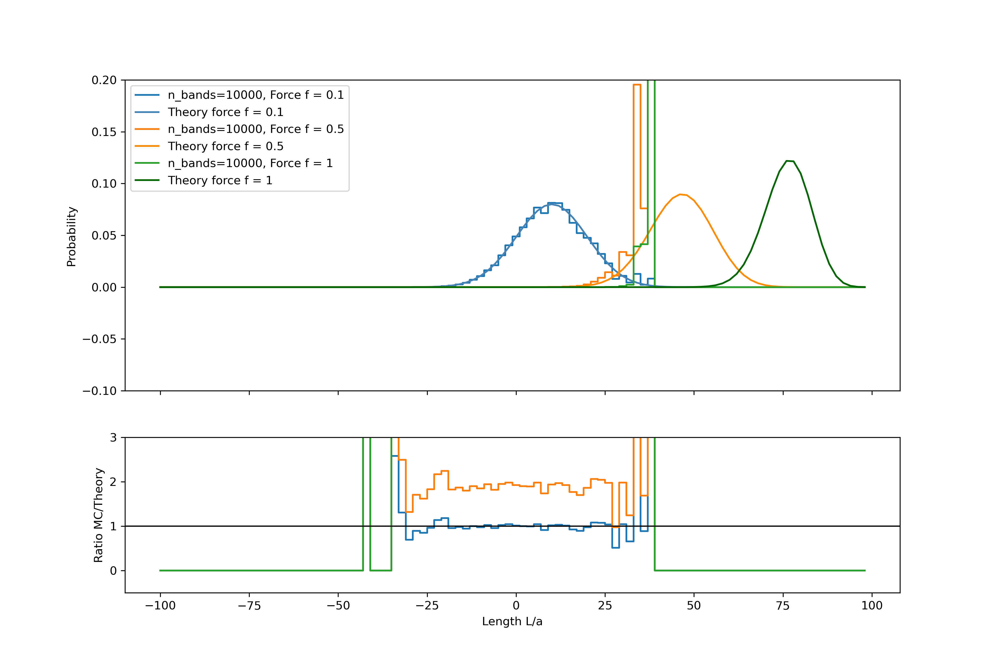

# Monte Carlo Simulation of Hooke's Law in Rubber Bands

A comprehensive Monte Carlo simulation framework that models rubber band behavior using statistical mechanics, demonstrating Hooke's law emergence from microscopic link configurations and thermal fluctuations.

## 🌟 Overview

This project provides an end-to-end Monte Carlo simulation to:
- Model rubber bands as collections of N discrete links with random orientations
- Simulate length distributions under zero force using statistical sampling
- Apply Boltzmann reweighting to study systems under external forces
- Implement importance sampling with biased probabilities for high-force regimes
- Validate Hooke's law emergence from microscopic statistical mechanics
- Compare simulation results with analytical predictions

Outputs (plots and analysis) are written to the `out/` directory.

## 📁 Project Structure

```
HooksLawMonteCarlo/
├── src/
│   ├── montecarlospring.py                 # Task 1: Zero-force simulation
│   ├── montecarlospring2.py                # Task 2: Boltzmann reweighting (small forces)
│   ├── montecarlospring2_large_forces.py   # Task 2: Large force analysis
│   ├── montecarlospring2_mueff.py          # Task 2: Effective sample size analysis
│   └── montecarlospring3.py                # Task 3: Importance sampling with biased probs
├── report.md                               # Detailed analysis and results
├── README.md                               # This file
├── requirements.txt                        # Python dependencies
├── flake.nix                               # Nix development environment (optional)
├── flake.lock                              # Nix lockfile
└── LICENSE                                 # Project license
```

## 🚀 Features

### Core Simulation Components
- **Link Class**: Represents individual rubber band segments with binary orientation (left/right)
- **RubberBand Class**: Collection of N links with configurable properties
- **Statistical Sampling**: Monte Carlo generation of microstates
- **Boltzmann Weighting**: Reweighting scheme for force application
- **Importance Sampling**: Biased probability sampling for efficient exploration

### Analysis & Visualization
- Length distribution histograms with theory comparison
- Chi-squared goodness-of-fit testing
- Force-dependent average length curves
- Effective sample size (μ_eff) analysis
- ROC-style ratio plots (MC/Theory)
- Validation of Hooke's law in linear regime

### Three Simulation Regimes
1. **Zero Force** (montecarlospring.py): Pure statistical sampling, binomial distribution
2. **Small Forces** (montecarlospring2.py): Boltzmann reweighting approach
3. **General Forces** (montecarlospring3.py): Importance sampling with modified probabilities

## 🛠️ Dependencies

Python packages:
- numpy (numerical computations)
- matplotlib (visualization)

Optional: A Nix flake is provided for reproducible development environments.

## 💻 Setup & Installation

### Option 1: Manual Setup (pip)

```fish
python -m venv .venv
source .venv/bin/activate.fish
pip install -r requirements.txt
```

For other shells:
- Bash/zsh: `source .venv/bin/activate`
- Windows (cmd): `.venv\Scripts\activate`

### Option 2: Conda (optional)

```fish
conda create -n hooke-mc python=3.12
conda activate hooke-mc
pip install -r requirements.txt
```

### Option 3: Nix (Advanced/Optional)

```fish
nix develop
```

## 🎯 Usage

### Task 1: Zero-Force Simulation

Simulates rubber bands with no external force, demonstrating binomial length distribution:

```fish
python src/montecarlospring.py
```

**Key parameters:**
- `N = 100` — number of links per rubber band
- `n_bands = 10000` — number of rubber bands in ensemble
- `a = 1` — link length

**Output:** `out/histogram_v1.png` showing MC vs analytical distribution

### Task 2: Force Application via Reweighting

Applies external forces using Boltzmann reweighting:

```fish
# Small forces (f = 0.01, 0.05, 0.1)
python src/montecarlospring2.py

# Large forces (f = 0.1, 0.5, 1.0)
python src/montecarlospring2_large_forces.py

# Effective sample size analysis
python src/montecarlospring2_mueff.py
```

**Output:** 
- `out/weighted_histogram_2.png` — small force regime
- `out/weighted_histogram_2_large_forces.png` — reweighting breakdown
- `out/weighted_histogram_2_mu_eff.png` — efficiency analysis

### Task 3: Importance Sampling

Implements biased sampling for efficient simulation across all force ranges:

```fish
python src/montecarlospring3.py
```

**Key features:**
- Biased link probabilities: `p_right = 0.5 * (1 + tanh(β·f·a))`
- Force sweep from 0.001 to 5.0
- Linear fit in Hooke's law regime
- Comparison with analytical expressions

**Output:**
- `out/histogram_3.png` — length distributions at various forces
- `out/av_length_by_force3.png` — average length vs force with linear fit

## 📊 Physical Model

### Microscopic Description

A rubber band consists of N links of length a, each pointing left (0) or right (1):

$$L = a(2n - N)$$

where n is the number of right-pointing links.

### Statistical Mechanics

**Zero force:** Each microstate has equal probability (p = 1/2^N)

**With force f:** Boltzmann distribution applies:

$$P(L) = \frac{\Omega(L) \cdot e^{\beta f L}}{Z}$$

where:
- Ω(L) = C(N,n) is the degeneracy (binomial coefficient)
- β = 1/(k_B·T) is the inverse temperature
- Z is the partition function

### Hooke's Law Emergence

In the small-force limit (β·f·a << 1):

$$\langle L \rangle \approx \frac{N a^2}{k_B T} f$$

This is Hooke's law with effective spring constant k = k_B·T/(N·a²).

For arbitrary forces, the exact result is:

$$\langle L \rangle = N \cdot a \cdot \tanh(\beta f a)$$

## 📈 Results (Summary)

### Task 1: Zero-Force Validation
- Excellent agreement with theory (χ²/N ≈ 0.65)
- Binomial distribution clearly observed
- Larger deviations at distribution tails due to finite sampling


### Task 2: Reweighting Analysis
- Works well for forces f < 0.2
- Breaks down for large forces (μ_eff drops dramatically)
- Effective sample size becomes insufficient at high forces






### Task 3: Importance Sampling Success
- Linear regime validated with fitted slope ≈ 95.5 (theory: 100)
- Excellent agreement with `tanh(βfa)` prediction across all forces
- Efficient sampling even in high-force regime


Detailed plots and analysis are available in `report.md` and the `out/` directory.

## 🧪 Implementation Details

### Random Number Generation
- Reproducible seeds (default: 12345)
- NumPy's default_rng for modern PRNG

### Numerical Methods
- Histogram binning with unit-width bins
- Error propagation: σ = √counts / Σcounts
- Chi-squared testing for goodness-of-fit
- Linear regression for Hooke's law validation

### Computational Efficiency
- Vectorized operations with NumPy
- Typical runtime: seconds to minutes depending on ensemble size
- Memory-efficient: O(N·n_bands) for ensemble storage

## ⚙️ Customization

### Adjusting Simulation Parameters

Edit the `if __name__ == "__main__":` block in each script:

```python
N = 100          # Number of links
n_bands = 10000  # Ensemble size
a = 1            # Link length
force = 0.05     # Applied force
```

### Temperature Effects

Modify the `RubberBand` class:

```python
self.kB = 1.38e-23  # Boltzmann constant (J/K)
self.T = 300        # Temperature (K)
self.beta = 1 / (self.kB * self.T)
```

### Output Directory

Results are saved to `out/`. Create this directory if it doesn't exist:

```fish
mkdir -p out
```

## 🔬 Physics Insights

This simulation demonstrates several fundamental concepts:

1. **Entropy-Elasticity Connection**: Rubber elasticity arises from entropy maximization, not energy minimization
2. **Statistical Emergence**: Hooke's law emerges from microscopic randomness
3. **Importance Sampling**: Shows when and why reweighting fails
4. **Thermodynamic Limit**: Demonstrates central limit theorem in action

## 📄 License

This project is licensed under the terms in the `LICENSE` file.

## 🤝 Acknowledgments

Developed as part of Applied Computational Physics coursework. Thanks to the statistical mechanics and Monte Carlo simulation community for foundational concepts.

## 📚 References

- Hooke's Law and Statistical Mechanics
- Monte Carlo Methods in Statistical Physics
- Boltzmann Distribution and Canonical Ensemble
- Importance Sampling Techniques

---

*Part of Computational Physics and Statistical Mechanics coursework*
