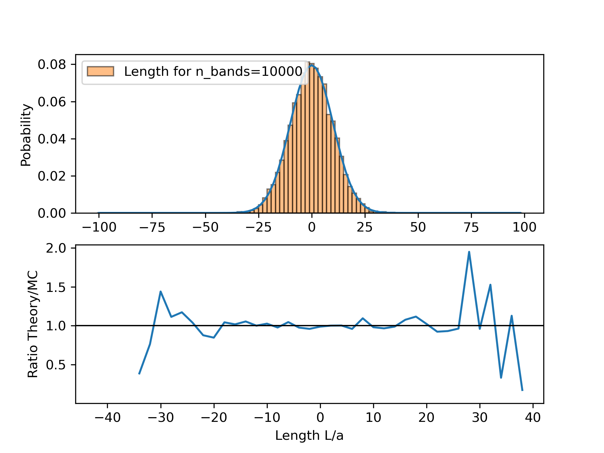
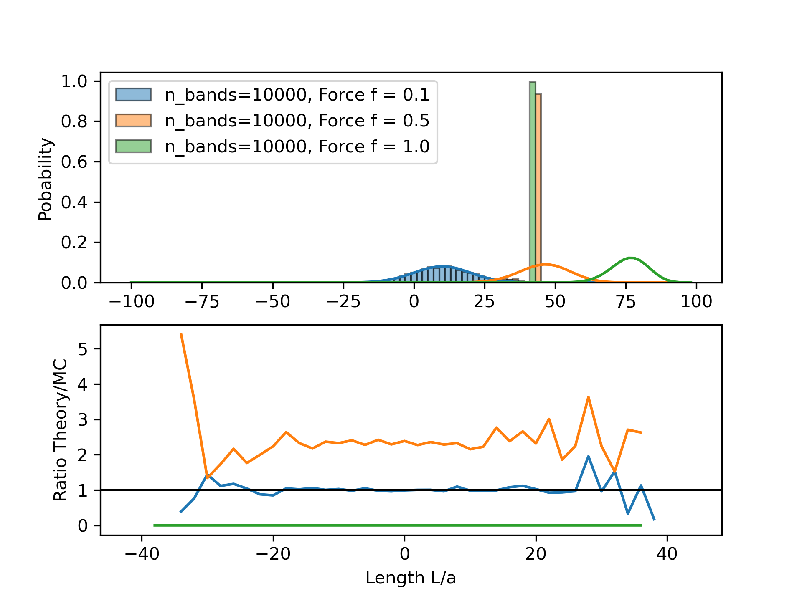
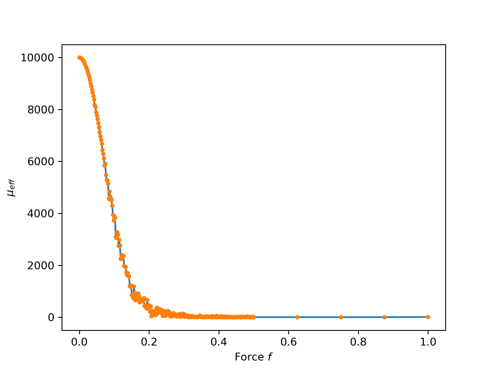
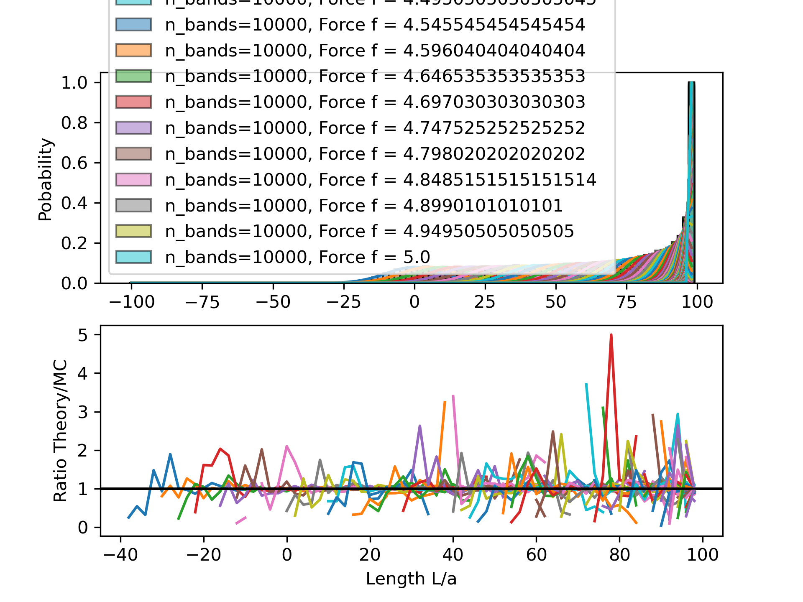
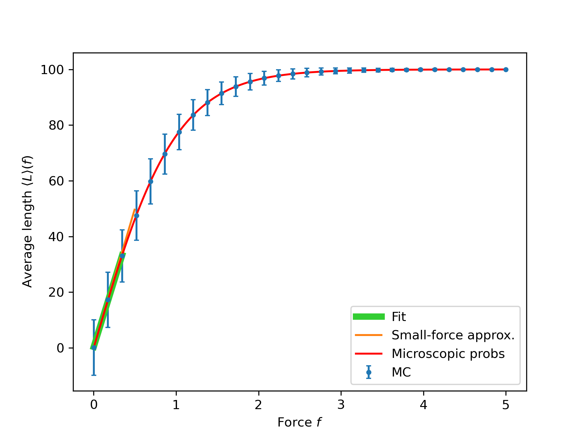

# Entropic Spring — Rediscover Hooke’s Law with Monte Carlo

A compact Monte Carlo study of a 1D “rubber band” that reproduces the entropic form of Hooke’s law. We compare three strategies — unbiased sampling, Boltzmann reweighting, and direct biased sampling — and validate against the analytic distribution.

## 🌟 Overview

This project provides an end-to-end workflow to:
- Model a polymer as N independent links pointing left/right with step size a
- Derive and sample the length distribution P(L) with/without an external force f
- Compare Monte Carlo histograms to the analytic result P(L|f) ∝ Ω(N,n) e^{β f L}
- Explore two ensemble strategies under force:
   - Reweighting: sample at f=0, weight by e^{β f L}
   - Direct sampling: draw links with p(right)=½[1+tanh(β f a)]
- Demonstrate the small-force limit ⟨L⟩ ≈ (N a² / k_B T) f (entropic Hooke’s law)

Generated plots are written to the `out/` folder for quick inspection.

## 📁 Project Structure

```
HooksLawMonteCarlo/
├── src/
│   ├── montecarlospring.py            # Unbiased sampling at f=0; compare to binomial P(L)
│   ├── montecarlospring2.py           # Reweighting approach for several forces; P(L|f)
│   ├── montecarlospring2_reweigh.py   # Reweighting scan + μ_eff vs force
│   └── montecarlospring3.py           # Direct biased sampling; ⟨L⟩(f) and Hooke limit
├── out/                               # Auto-created; all plots saved here
│   ├── histogram_v1.png               # Example: P(L) at f=0 (MC vs theory)
│   ├── weighted_histogram_2_large_force.png
│   ├── weighted_histogram_2_large_force_reweigh.png
│   ├── weighted_histogram_2_mu_eff.png
│   ├── histogram_3.png
│   └── av_length_by_force3.png
├── README.md                          # This file
├── requirements.txt                   # Minimal Python dependencies
├── flake.nix                          # Nix dev shell (optional)
├── flake.lock                         # Nix lockfile
└── .vscode/                           # Optional editor settings
```

## 🚀 Features

- Simple polymer model (N links, each left/right) with length L = a(2n−N)
- Analytic probability with/without force using Ω(N,n)=C(N,n)
- Monte Carlo engines:
   - Unbiased sampling at f=0 (binomial)
   - Boltzmann reweighting to emulate finite f
   - Direct biased sampling using p(right)=½[1+tanh(β f a)]
- Plots and diagnostics:
   - Length histograms (MC vs analytic) and ratio panels
   - Reweighting stability via effective sample size μ_eff
   - ⟨L⟩ vs f with small‑force (Hooke) line and exact tanh curve

## 🛠️ Dependencies

Python packages used by the scripts:
- numpy
- matplotlib

An optional Nix flake is provided for a fully reproducible dev shell.

## 💻 Setup & Installation

### Option 1: Python venv (Recommended)

```fish
python3 -m venv .venv
source .venv/bin/activate.fish
pip install -r requirements.txt
```

Deactivate with `deactivate` when done. For Bash/zsh users: `source .venv/bin/activate`.

### Option 2: Conda (optional)

```fish
conda create -n entropic-spring python=3.12
conda activate entropic-spring
pip install -r requirements.txt
```

### Option 3: Nix (Advanced/Optional)

The repo includes a Nix flake that provides a development shell with the core Python packages:

```fish
nix develop
```

## 🎯 Usage

Ensure your environment is activated (venv, conda, or nix shell), then run any script below.

1) Unbiased sampling at f=0: compare MC P(L) to analytic binomial

```fish
python src/montecarlospring.py
```

Outputs: `out/histogram_v1.png`

2) Reweighting from f=0 to finite f values; compare to analytic P(L|f)

```fish
python src/montecarlospring2.py
```

Outputs: `out/weighted_histogram_2_large_force.png`

3) Reweighting scan + effective sample size μ_eff vs f

```fish
python src/montecarlospring2_reweigh.py
```

Outputs: `out/weighted_histogram_2_large_force_reweigh.png`, `out/weighted_histogram_2_mu_eff.png`

4) Direct biased sampling at finite f; ⟨L⟩(f), Hooke’s-law limit, and exact curve

```fish
python src/montecarlospring3.py
```

Outputs: `out/histogram_3.png`, `out/av_length_by_force3.png`

Key parameters are defined inside each script:
- Polymer size: `N` (default 100), step size `a` (default 1)
- Thermodynamics: `kB=1`, `T=1` so β=1/(k_B T)=1 by default
- Number of bands (toys): `n_bands` (default 10,000)
- Force scan: see the `forces` arrays inside scripts 2 and 3

## 📊 Sample Output

Example figures produced by the scripts in this repo:











If these images are not present yet, run the scripts to generate them.

## 🧪 Model and Theory (brief)

- Microstate: N independent links, each dir ∈ {left,right}. Length for n right links: L=a(2n−N).
- Multiplicity: Ω(N,n)=C(N,n). At f=0: P(L)∝Ω(N,n). With force f: P(L|f)∝Ω(N,n) e^{β f L}.
- Direct sampling under force: p(right)=½[1+tanh(β f a)].
- Small‑force limit: ⟨L⟩≈(N a² β) f = (N a² / k_B T) f — an entropic Hooke’s law with k_eff = k_B T / (N a²).

## ⚙️ Tips & Notes

- Reproducibility: NumPy RNG is seeded as `np.random.default_rng(12345)`.
- Reweighting reliability: watch μ_eff — it drops when target f is far from the proposal (f=0) ensemble.
- CPU runs are fast; no GPU is needed.
- Feel free to tweak N, a, and force grids to explore different regimes.

## 📄 License

This project is licensed under the GNU General Public License v3.0 or later (GPL-3.0-or-later). See `LICENSE` for the full text.

## 🤝 Acknowledgments

Inspired by classic treatments of entropic elasticity in statistical physics. Educational use.

---

Made with Python, NumPy, and Matplotlib.