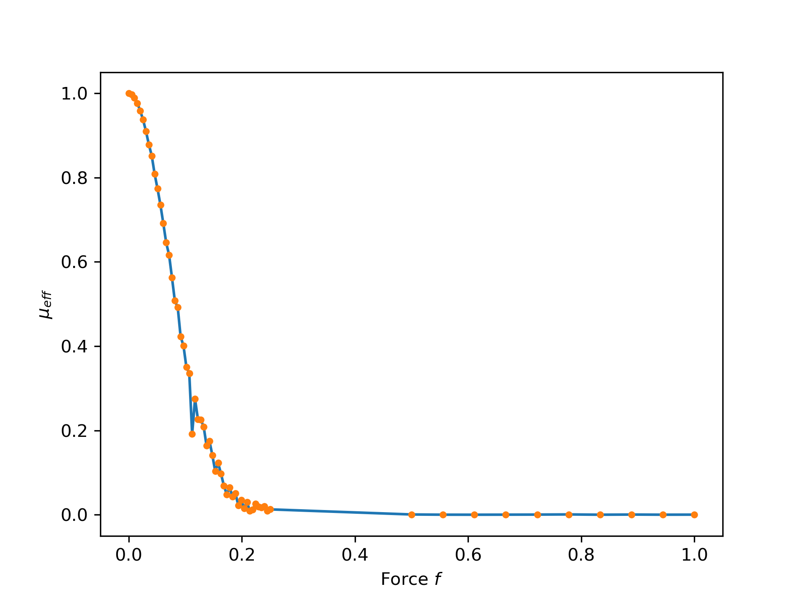

# Project Report Hooks Law with Monte Carlo Konstantin Unruh

## Problem

We simulate a rubber bund by dividing the rubberband into N links of length a. Each link can either point in the right or left direction. The total length is then calculated 
depending on how many links point in the right direction n. 

$$
L = a(2n -N)
$$

## Simulation Task 1

First we start with no force acting on the rubberband. For each link we then set the direction randomly with probability of $p = 0.5$. 
We then have a certain length distribution for all rubberbands. 
There are more possibilities to orient all links to reach a 
small total length, than for larger total lengths. E.g. for 
the maximum positive length there is only one configuration, 
all right, possible.

The theory aligns very well with the monte carlo simulation (for $N=100$ and $10000$ rubberbands). The deviation from the theory is 
larger for the ends of the spectrum i.e. large lengths which are more improbable. So there are less monte carlo cases, so the deviation 
is larger. We get $\chi^2/N = 0.65$.

## Simulation Task 2

Now a force is introduced. Instead of resampling we will just reweigh the bins. 
We calculate the Boltzmann weight for each microstate. Now we apply the reweighting: 
Instead of just adding $1$ to a bin, we add the Boltzmann weight to the bin.

### Small forces

 

For relatively small forces below $0.1$ the reweighing works just fine. 
The distribution skews a bit to the right, which means the average length increases 
as we apply a force. 

### Large forces

For high forces the reweighting does not work properly anymore. The distribution 
moves far to the right. Then there are no counts anymore we can boost with larger 
boltzmann weights. We can validate this when looking at the number of 
effective samples $\mu_{eff}$.

We see that for forces larger than $\sim 0.2$ the number of effective 
sample is reduced significantly. A different approach is necessary to achieve a 
better result.

## Simulation Task 3

Instead of reweighting we now adapt the direction probability of each link 
directly. In the following plot the average monte carlo lengths, the small force approximation $\frac{N a^2}{k_B T} f$, the microscopic probability  $N \cdot a \cdot tanh(\beta f \cdot a)$. We also do a linear fit of our 
monte carlo samples in the low force linear region and obtain a slope 
of $95.5$ which agrees with the theoretical value.

